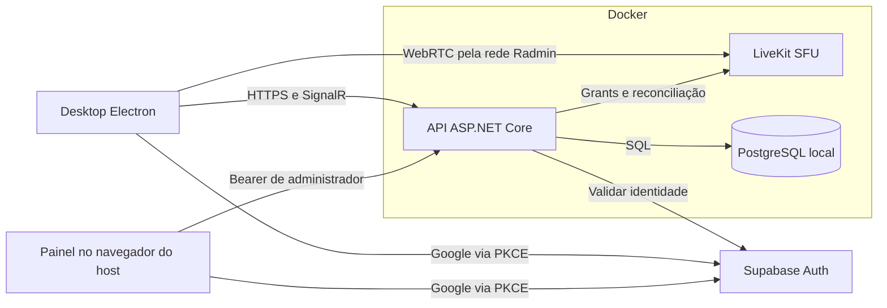

# Arquitetura atual

Discorda usa Electron/React/TypeScript no desktop e um monólito modular ASP.NET Core .NET 10. Um servidor representa um grupo privado. O código do projeto é MIT; dependências preservam suas licenças.

## Implantação de casa

- Supabase hospeda apenas identidade/login; o PostgreSQL do Compose guarda contas locais, whitelist, sessões, canais e mensagens.
- Electron Main administra o login e credenciais. O renderer é isolado por preload e recebe APIs específicas. O arquivo privado de conexão fixa a confiança TLS no servidor.
- API valida JWT, identidade Google confirmada e whitelist. SignalR transmite presença/eventos, não mídia. LiveKit encaminha mídia e recebe concessões curtas autorizadas pela API.
- Compose possui um serviço de migration que precisa concluir antes de iniciar a API. PostgreSQL não publica porta no host. O estado é persistido em volumes.
- API HTTPS e LiveKit ICE são publicados no IP Radmin. O painel HTTP é publicado somente em loopback. Configurações e certificados ficam fora do código, em `.discorda/selfhost`.
- O painel exige e-mail administrador explicitamente configurado e verificado pelo servidor. A lista de IPs é persistida, mas precisa ser aplicada ao Firewall Windows pelo operador. Não há acesso do container ao Docker socket ou execução arbitrária no host.
- Atualização do provedor Google usa Supabase Management API com PAT transitório. O painel nunca devolve secrets. Rotação de credenciais de infraestrutura exige operação no host e reinício.
- Builds comunitárias não atualizam a partir do canal oficial. Releases oficiais exigem assinatura Ed25519 do manifesto e verificação do instalador.

## Operação e limites

Leia o [README](README.md), [operação](docs/selfhosting-operations.md) e [modelo de segurança](SECURITY.md). A receita inicial é Windows/Radmin; uma implantação pública com domínio/TURN demanda configuração adicional. O host precisa permanecer ligado. Não há migração automática do piloto, renovação automática de certificado ou controle automático do Firewall Windows.

O [documento original de proposta](docs/architecture-proposal.md) preserva as decisões e alternativas da fase inicial; itens planejados ali não significam funcionalidades implementadas. Os relatórios de fase em `docs/` registram a evolução histórica.
