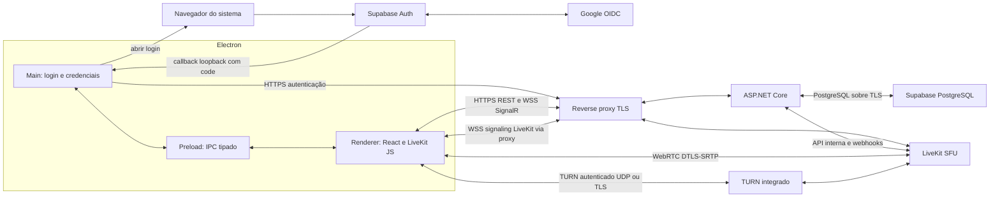

# Discorda — arquitetura proposta

Status: arquitetura aprovada pelo usuário em 28/09/2026; implementação incremental iniciada. Data: 28/09/2026.

## 1. Escopo e decisões centrais

Aplicativo privado para aproximadamente 15 contas e até 15 pessoas na mesma chamada. Um workspace, canais de texto e voz, login Google com whitelist, chat persistente, presença, microfone, webcam e tela simultâneos. Windows será a plataforma inicial de homologação; macOS e Linux terão capacidades explicitamente informadas pela interface.

Recomendação: Electron + React/TypeScript no desktop; monólito modular ASP.NET Core/.NET 10 para regras, sessões e chat; PostgreSQL gerenciado no Supabase; SignalR para eventos da aplicação; LiveKit self-hosted para mídia e seu próprio signaling; TURN integrado ao LiveKit. Docker Compose em uma VPS Linux, sem Kubernetes, Redis, mensageria externa ou microsserviços na primeira versão.

Não implementar SFU, TURN, codecs ou protocolos de mídia próprios. Não construir mesh temporária: até o primeiro teste com duas pessoas utilizará a SFU definitiva. Segurança, TURN, empacotamento e reconexão entram cedo, não como acabamento final.

Fora do primeiro release: anexos, gravação, transcrição, bots, threads, DMs, amigos, múltiplos servidores públicos, 4K e promessa de 15 telas 1080p simultâneas. Cada usuário poderá publicar microfone, câmera e tela; a interface poderá oferecer vários compartilhamentos, mas assinará a tela selecionada em alta qualidade. O perfil inicial a homologar é 15 vozes, webcams adaptativas e uma tela 1080p/30 em destaque.

## 2. Arquitetura e fronteiras



O caminho de mídia não passa por ASP.NET, SignalR nem PostgreSQL. O reverse proxy HTTP termina TLS dos endpoints HTTPS/WSS; não é um relay de UDP WebRTC. STUN/TURN e mídia precisam de portas e encaminhamento próprios.

| Componente | Responsabilidades e limites |
|---|---|
| Electron Main | Ciclo de vida da janela, browser externo, listener OAuth temporário, cofre de refresh token, enumeração/autorização de captura, atualizações futuras. Não renderizar chat nem processar mídia. |
| Preload | Métodos específicos com payloads validados: login, logout, obter token curto, selecionar captura e preferências locais. Não expor IPC genérico, filesystem, shell ou fetch arbitrário. |
| Renderer | UI, REST/SignalR com token curto em memória, LiveKit JS, preview, elementos de áudio/vídeo e lifecycle das tracks. Sem Node. |
| ASP.NET Core | Identidade local, whitelist, autorização, sessões, canais, mensagens, presença, concessão de acesso à mídia e reconciliação. |
| PostgreSQL | Fonte durável de usuários, permissões, sessões e mensagens. Transações, constraints e índices. |
| SignalR | Eventos de mensagens, presença, typing e projeção de ocupação dos canais. Não transportar áudio/vídeo, SDP ou ICE do LiveKit. |
| LiveKit | Salas de mídia, signaling WebRTC, negociação, encaminhamento e adaptação das tracks. Não decidir whitelist ou permissões de negócio. |
| TURN | Relay autenticado quando a conexão direta cliente–SFU não funciona. Não é substituto da SFU. |

Escolher versões estáveis e compatíveis no início de cada fase, fixar lockfiles/imagens e manter patching. A API usará .NET 10; não é necessário fixar aqui versões mutáveis de Electron, React e LiveKit sem um teste conjunto.

## 3. Desktop, interface e lifecycle

Electron, TypeScript, React, Vite, Tailwind CSS e shadcn/ui. Organização por funcionalidades: auth, channels, chat, presence, call e settings. TanStack Query para dados REST; estado local React e um store pequeno apenas para estado compartilhado da chamada. Não duplicar o estado interno do SDK de mídia em vários stores.

Uma conexão SignalR por sessão e uma instância Room do LiveKit por chamada. Um CallController fora dos componentes visuais possui tracks, listeners, dispositivos e estados: disconnected → joining → connected → reconnecting → leaving. Desmontar uma miniatura apenas desanexa o elemento; sair da chamada encerra a sessão. Cleanup idempotente para evitar efeitos duplicados, inclusive no StrictMode.

Identidade visual própria: superfícies grafite, destaque verde/âmbar moderado, tipografia legível, foco visível e labels acessíveis. Navegação lateral compacta, canais à esquerda, conteúdo central e membros recolhíveis à direita. A barra de servidor pode ser omitida enquanto existe apenas um workspace. Grid responsivo para 1, 2, 4, 6 ou mais câmeras; tela selecionada em destaque com miniaturas. DND controla notificações, não autorização nem áudio automaticamente.

Microfone: echoCancellation, noiseSuppression e autoGainControl como defaults ajustáveis, sem DSP próprio. Deafen pausa reprodução recebida e também muta microfone por padrão, restaurando o estado anterior ao sair; documentar isso na UI. Volume individual é local, não altera o áudio dos demais. Indicador de fala vem do SDK. Escolha de saída via capacidade disponível de setSinkId/SDK; fallback para dispositivo padrão do SO.

Ao desligar câmera/parar tela, despublicar e parar tracks para liberar dispositivo e captura. Ao mutar microfone, pode-se manter a captura durante a chamada para troca rápida, com estado visível; ao sair/logout/fechar, parar todas as tracks. Preview de dispositivos também precisa de cleanup. Troca de hardware e devicechange exigem fallback explícito e preservação do estado de mute.

## 4. Supabase Auth, Google e sessão da aplicação

Atualizado pela decisão do usuário em 28/09/2026. Supabase passa a ser a autoridade de identidade e emissão/renovação de tokens; .NET continua autoridade de acesso ao Discorda. O ADR 0010 substitui o fluxo Google Desktop direto e as sessões de refresh próprias anteriormente propostos.

Fluxo padrão: SDK Supabase no Electron Main → navegador do sistema → Supabase Auth com provider Google → callback loopback com código → exchangeCodeForSession usando PKCE → JWT Supabase apresentado ao .NET. Não usar BrowserWindow para login. Callback local 127.0.0.1:3000/redirect/<segmento-aleatório>, autorizado no painel por regra específica. A porta é fixa nesta primeira implementação; ocupação gera erro explícito. Cada tentativa expira em cinco minutos e fecha o listener ao concluir/cancelar.

O .NET valida assinatura ES256/RS256 via JWKS, issuer do projeto, audience authenticated, expiração, role e session_id. Consulta também o usuário no Supabase Auth para confirmar email e vínculo Google; user_metadata é apenas apresentação. Whitelist Enabled e vínculo estável AuthIssuer/AuthSubject são exigidos em cada acesso. Cadastro no Supabase sozinho não autoriza entrada.

Access e refresh tokens são emitidos pelo Supabase. A validade vem das configurações do projeto, não de prazo imposto pelo .NET. ApplicationSession guarda o session_id, usuário e revogação local, sem refresh token. Logout revoga a sessão no Discorda e solicita signOut local ao Supabase. Bloqueio administrativo revoga todas as sessões locais do usuário. Sem rede, limpar o dispositivo não garante revogação remota imediata: informar a limitação e respeitar expiração do access token.

Main mantém sessão no cofre safeStorage, com fallback apenas em memória quando o SO não oferece armazenamento seguro. Nunca persistir tokens em localStorage, logs ou bundle. Nesta fase, renderer recebe apenas estado/perfil via IPC; quando SignalR for implementado, disponibilizar somente o access token necessário em memória, com escopo de IPC definido. Tokens do provider Google não são persistidos.

O cadastro OAuth Server da imagem fornecida transforma Supabase em provedor para clientes terceiros e exige página própria de login/consentimento. Não é necessário para o login social direto recomendado. A publishable key do projeto e Google habilitado em Sign In / Providers são as configurações exigidas pelo fluxo atual.

Detalhes, diagrama e configuração operacional: [Supabase Auth](docs/supabase-auth.md). Fontes: [Google pelo Supabase](https://supabase.com/docs/guides/auth/social-login/auth-google), [OAuth Server](https://supabase.com/docs/guides/auth/oauth-server/getting-started) e [sessões](https://supabase.com/docs/guides/auth/sessions).
## 5. Supabase e persistência

Usar Supabase como PostgreSQL gerenciado e como provedor Auth. Sem Realtime, Edge Functions ou acesso direto do Electron às tabelas de negócio. .NET mantém autorização e eventos da aplicação. Anexos poderão usar Storage privado no futuro, com URLs curtas emitidas após autorização .NET.

EF Core + Npgsql, DbContext por operação e migrations versionadas. Conexão direta TLS quando a VPS suporta a família IP do endpoint; em VPS IPv4-only usar pooler em modo session. Pool pequeno, inicialmente máximo 10 conexões. Migrations e backups usam conexão administrativa apropriada separada, nunca a credencial de runtime. [Conexões Supabase](https://supabase.com/docs/guides/database/connecting-to-postgres).

Tabelas da aplicação em schema privado não exposto pela Data API; revogar acesso de anon/authenticated. Role de runtime com privilégios mínimos, sem BYPASSRLS/superuser. RLS pode acrescentar defesa, mas não substituir autorização .NET e não supor que auth.uid() existe nessa conexão. Desabilitar Data API se não utilizada ou restringir schemas expostos.

### Modelo proposto

| Entidade | Campos/regras essenciais |
|---|---|
| User | UUID, AuthIssuer, AuthSubject, Email, DisplayName, AvatarUrl, CreatedAt, LastSeenAt. Unique(issuer, subject). Não usar GoogleId como PK. |
| AllowedUser | UUID, NormalizedEmail único, Enabled, BoundUserId opcional único, AddedAt, UpdatedAt. Sem remover pontos/+alias de emails automaticamente. |
| Workspace | UUID, Name, CreatedAt; um registro inicial. |
| WorkspaceMember | PK(workspaceId,userId), Role Owner/Member, JoinedAt. Sem entidade Friend. |
| Channel | UUID, WorkspaceId, Name, Type Text/Voice, SortOrder, ArchivedAt, Version. Criação por membro autorizado; arquivamento por dono/moderação conforme política. |
| Message | UUID, ChannelId, AuthorId, ClientMessageId, Body, CreatedAt, EditedAt, DeletedAt, ReplyToMessageId opcional, Version. |
| ApplicationSession | UUID igual ao session_id Supabase, UserId, CreatedAt, RevokedAt. Revogação local, sem refresh token próprio. |
| MediaAdmission | UUID, UserId, SessionId, ChannelId, RoomName/RoomEpoch, Identity, State, ExpiresAt, CreatedAt. Controla uma entrada autorizada e tentativas idempotentes. |
| AuditEvent | Autor, ação administrativa, alvo, instante e correlationId; sem texto de mensagens ou credenciais. |

Todos os horários persistidos em UTC/timestamptz. FKs e check constraints para tipos, tamanhos e relações. Índice Message(ChannelId, CreatedAt, Id); unique(AuthorId, ClientMessageId) para deduplicação. Reply só para mensagem do mesmo canal; exclusão deixa tombstone sem corpo para preservar replies. Edição/exclusão permitidas ao autor e ao Owner segundo política explícita. Conflito de Version retorna 409, sem sobrescrever silenciosamente.

VoiceSession e VoiceParticipant históricos não são necessários no MVP. A ocupação corrente é projeção reconciliada do LiveKit e não tabela que promete presença permanente. MediaAdmission guarda autorização, não comprova conexão. Se histórico de chamadas for solicitado, adicionar sessões e participações com retenção curta. MessageAttachment fica para a fase de anexos.

## 6. REST, SignalR e presença

REST /api/v1 para comandos duráveis e consultas; SignalR /hubs/app para notificações e eventos efêmeros. OpenAPI gera tipos do cliente; DTOs de eventos têm versão explícita. Não manter envio de mensagens duplicado em REST e hub.

| Operação | Transporte e regra |
|---|---|
| Login/refresh/logout | HTTPS; endpoints dedicados, limites por IP e sessão |
| Listar/criar canais | REST; workspace autorizado; Type imutável após criação |
| Histórico | GET messages?before=cursor, até 50; cursor composto e validado |
| Enviar/editar/excluir | POST/PATCH/DELETE REST; autorização e idempotência; resposta confirma persistência |
| Novas mensagens/edições/exclusões | SignalR com eventId, entityId e version |
| Typing | Hub, limitado por usuário/canal; expira em 5 segundos; não persistido |
| Presença | Hub e snapshot REST; versão para evitar aplicação fora de ordem |
| Solicitar/sair de voz | REST admissions; LiveKit controla conexão de mídia |

Mensagem é gravada em transação antes de publicar evento. Se o processo cair após commit e antes do broadcast, histórico continua íntegro. Na primeira versão, ressincronizar a janela recente via REST em reconnect/foco e a cada 30 segundos no canal aberto; aplicar por ID/version, incluindo tombstones. Isso também recupera edição antiga carregada na janela. Uma outbox transacional pode ser adicionada se entrega imediata de eventos se tornar requisito; SignalR sozinho não é log durável.

Ao reconectar, renovar token, reassinar grupos autorizados e buscar snapshots; não assumir replay de todos os eventos. Registrar eventos durante obtenção do snapshot e conciliar por versões, com deduplicação. Não mostrar mensagem como enviada só porque foi colocada na fila local. Retry mantém ClientMessageId.

Presença por usuário agrega todas as conexões: Online se alguma está ativa; Idle após 5 minutos sem atividade local como indicação de UX; DND é preferência explícita; Offline sem conexões válidas. Heartbeat de aplicação a cada 20 segundos, lease de 60 segundos, valores iniciais ajustáveis. LastSeenAt é persistido em transições com escrita limitada. Não confundir presença do chat com participação confirmada na SFU. Restart da API reconstrói presença após reconexões.

Hub protegido com autenticação, autorização por operação e por grupo. Habilitar fechamento por expiração e renovação/reconnect do cliente; token em query string, se exigido pelo transporte, só aceito no caminho do hub e removido de logs do proxy/APM. [Autenticação SignalR](https://learn.microsoft.com/aspnet/core/signalr/authn-and-authz).

## 7. WebRTC: mesh versus SFU

Estimativa de engenharia: com 15 participantes, mesh exige 14 destinos por publicador e 105 pares. Para uma câmera de 1,5 Mb/s, o upload de um participante pode atingir 21 Mb/s; tela de 4 Mb/s enviada a 14 pessoas exige 56 Mb/s. Encoder, implementação e reaproveitamento de frames influenciam CPU, mas as múltiplas conexões, congestionamento e banda continuam problemáticos.

Na SFU o cliente publica cada track/camada ao servidor, não uma cópia por destinatário. Simulcast pode transmitir mais de uma camada, portanto não significa literalmente um único fluxo constante. A SFU distribui apenas o que foi assinado. O servidor assume custo de egress; clientes ainda podem sobrecarregar decodificação com 14 vídeos grandes.

| Opção | Vantagem | Custo/limitação | Decisão |
|---|---|---|---|
| Mesh | Pouca infraestrutura inicial | Upload por destinatário; diagnóstico/reconnect difíceis em grupo | Rejeitar para o produto |
| LiveKit | SFU e SDK de cliente com salas, tracks e adaptação | Serviço adicional; controle e grants precisam de integração | Recomendada |
| mediasoup | SFU flexível, controle fino | Biblioteca de baixo nível; aplicação precisa construir signaling e gestão de sessões | Mais trabalho do que o grupo precisa |
| Janus | Gateway com plugins, inclusive videoroom | Integração de plugins e controle mais manual | Alternativa se surgir necessidade específica de gateway |

Fontes: [mediasoup design](https://mediasoup.org/documentation/v3/mediasoup/design/), [Janus](https://janus.conf.meetecho.com/docs/) e [LiveKit self-hosting](https://docs.livekit.io/transport/self-hosting/).

Usar LiveKit JS no renderer. Adaptador IMediaService no backend emite JWTs com biblioteca JOSE mantida e chama RoomService documentado. Avaliar manutenção de SDK .NET antes de escolhê-lo; não assumir SDK C# oficial completo. Na ausência de SDK adequado, cliente HTTP fino para API documentada é suficiente, sem implementar signaling próprio. Verificação de assinatura/hash de webhook deve seguir a especificação e ter testes. [RoomService](https://docs.livekit.io/reference/other/roomservice-api/), [webhooks](https://docs.livekit.io/intro/basics/rooms-participants-tracks/webhooks-events/).

Voz Opus; VP8 como baseline de vídeo e teste de H.264 para hardware disponível. Não exigir AV1. Simulcast para webcam, adaptive stream e dynacast para reduzir publicação/assinatura; telas precisam de teste próprio de legibilidade e movimento. Miniaturas recebem resolução baixa; somente tela em destaque recebe alta resolução. Não prometer transcodificação: SFU encaminha streams, não converte codecs por destinatário. [Mídia avançada LiveKit](https://docs.livekit.io/transport/media/advanced/).

## 8. Entrada, saída, reconexão e bloqueio

### Entrada em canal

1. Cliente chama POST /channels/{id}/admissions com idempotency key.
2. Backend verifica sessão, whitelist, associação, canal Voice, limite de 15 e uma admissão ativa por usuário. Concorrência é resolvida no servidor, não por contador do cliente.
3. Backend cria admissão pending de 60 segundos e retorna URL SFU e token de entrada com validade inicial de 60 segundos: room exata, identity derivada da admissão, grants mínimos join/publish/subscribe e fontes permitidas. Nunca grant administrativo para o desktop.
4. SDK conecta ao signaling LiveKit, negocia ICE/DTLS e publica microfone conforme escolha do usuário. Câmera e tela só por ação explícita.
5. Webhook validado e/ou consulta RoomService confirma participante; backend transforma admissão em connected e publica ocupação via SignalR. Cliente pode mostrar a si mesmo como conectando até confirmar.
6. Webhooks são deduplicados, podem atrasar e chegar fora de ordem; reconciliar consultas da SFU a cada 15 segundos e após restart. Não confiar em POST do cliente dizendo que conectou.

### Saída e troca de canal

Ao sair: silenciar localmente de imediato, parar tracks, desanexar elementos, remover listeners, disconnect SDK e enviar DELETE admission idempotente. Backend marca encerramento, solicita RemoveParticipant e publica nova projeção após confirmação. Falha de rede no DELETE não impede cleanup local; timeout/reconciliação limpa servidor. Troca de canal encerra a admissão anterior antes de liberar nova. Fechamento forçado do processo é tratado por disconnect/lease, sem depender de beforeunload.

### Reconexão

Separar reconexão SignalR da de mídia. Queda só do chat não recria Room nem interrompe imediatamente uma chamada saudável. SDK tenta recuperar mídia com backoff/jitter dentro de uma janela inicial de 30 segundos; em seguida, cliente solicita nova admissão autorizada. Nunca recriar PeerConnection por renderização. Preservar intenção de mute/câmera, mas não reabrir captura de tela sem confirmação se a track terminou ou o SO pedir nova seleção.

Em reinício da SFU todas as chamadas caem; backend reconcilia salas, limpa admissões obsoletas e clientes reentram com autorização nova. Em indisponibilidade do banco, negar novos logins/admissões/comandos e mostrar erro recuperável. Não confirmar mensagens não persistidas. API indisponível permite apenas recuperação transitória pelo SDK; não é autorização para sessões ilimitadas.

### Limitação importante de revogação self-hosted

No LiveKit self-hosted, RemoveParticipant não revoga tokens existentes; além disso o servidor renova tokens de reconexão durante a sessão. TTL inicial de 60 segundos não garante bloqueio da mídia em 60 segundos. Backend bloqueia novas emissões, remove participantes e rejeita/reexpulsa admissões revogadas na reconciliação, mas um cliente malicioso com token válido pode tentar voltar. [Lifecycle de tokens LiveKit](https://docs.livekit.io/frontends/reference/tokens-grants/).

Recomendação para bloqueio administrativo forte no pequeno grupo: interromper as salas afetadas, suspender novas admissões, reiniciar o único LiveKit com chave API nova e reconectar somente usuários autorizados em salas com novo epoch. A operação afeta chamadas em andamento e deve ter runbook/teste; invalidar todas as chaves antigas e sessões existentes é essencial. Pode ser manual inicialmente, acionada pelo administrador após bloqueio. Rotacionar apenas nome de sala ou só expulsar não basta, pois clientes podem recriar salas antigas com tokens válidos.

Aprovar explicitamente esta interrupção rara ou escolher serviço com revogação adequada e custo adicional. Se bloqueio instantâneo sem interrupção global for requisito, essa decisão precisa mudar antes do release; não esconder a limitação atrás de JWT curto.

## 9. STUN, TURN, portas e Docker

ICE testa caminhos disponíveis. STUN descobre endereço acessível; TURN retransmite quando NAT/firewall impede caminho direto. Mesmo com SFU de IP público, clientes em redes restritivas podem precisar de TURN. UDP é preferido; ICE/TCP e TURN/TLS são fallback e podem aumentar latência.

Começar com TURN integrado do LiveKit, reduzindo um serviço e integrando autenticação. Coturn é alternativa para relay separado ou requisitos específicos: credenciais efêmeras derivadas de segredo apenas no backend, quotas por usuário, negação de relay a redes privadas/loopback e faixa UDP de relay definida. Nunca relay anônimo nem credenciais fixas distribuídas no aplicativo.

| Porta | Uso proposto | Exposição |
|---|---|---|
| TCP 80 | ACME/redirect HTTPS, se usado | Pública, somente proxy |
| TCP 443 | HTTPS API e WSS de ambos os serviços | Pública via proxy |
| TCP 7880 | API/signaling interno LiveKit | Apenas loopback/rede de serviços |
| UDP 7882 | ICE UDP mux escolhido para implantação inicial | Pública diretamente na SFU |
| TCP 7881 | ICE TCP fallback | Pública diretamente na SFU |
| UDP 3478 | TURN/STUN integrado | Pública, TURN autenticado |
| TCP 443 no endpoint TURN | TURN sobre TLS | L4 até LiveKit; não proxy HTTP |
| TCP 5349 interno | Listener TURN/TLS atrás do roteador L4, se adotado | Conforme topologia validada |
| TCP 5432 de saída | Postgres direto/pooler session | VPS → Supabase, TLS |

Não abrir também 50000–60000/UDP se rtc.udp_port mux estiver configurado. Se escolher faixa em vez de mux, calcular capacidade e mapear faixa explicitamente. Confirmar candidatos anunciando IP público, IPv4/IPv6, firewall do provedor e do host. [Portas LiveKit](https://docs.livekit.io/transport/self-hosting/ports-firewall/).

HTTPS e TURN/TLS disputam TCP 443 no mesmo IP. Subdomínios diferentes sozinhos não resolvem isso. Proposta com um IP: HAProxy em modo TCP/SNI separa turn.exemplo de api.exemplo e media.exemplo; TURN segue em TLS até LiveKit, e HTTPS segue para Caddy em porta interna. Certificados de TURN precisam de emissão/renovação própria automatizada e reload testado. Alternativa mais simples de operar: segundo IP para TURN; depende de custo do provedor. Só oferecer 5349 público reduz alcance em redes restritas.

Compose terá backend, Caddy, LiveKit e, na opção de IP único com TURN 443, HAProxy. Linux host networking para LiveKit simplifica mídia, mas exige bind/firewall para portas internas; os demais serviços só publicam o necessário. Sem gravação/egress workers, Redis ou coturn adicional inicialmente. Não instalar Supabase completo na mesma VPS.

## 10. Tela, webcam e áudio do sistema

Main enumera fontes com desktopCapturer e concede apenas a seleção pendente do usuário por setDisplayMediaRequestHandler. Renderer inicia getDisplayMedia por gesto do usuário. Validar frame/origin, sourceId contra enumeração recente e consentimento de uso único; não permitir que um renderer envie um ID arbitrário para captura silenciosa. Se SO usa seletor próprio, respeitar o fluxo e capacidades disponíveis.

Tracks distintas: microphone, camera, screen_share e screen_share_audio. Isso permite volume e layout independentes; não misturar microfone e desktop previamente. Evento ended da captura aciona cleanup e atualiza UI/publicação.

| Preset proposto | FPS | Faixa inicial de bitrate de vídeo |
|---|---|---|
| Tela 720p | 15 ou 30 | 1–2,5 Mb/s |
| Tela 1080p | 15 ou 30, padrão 30 | 3–6 Mb/s |
| Tela 1080p experimental | 60 | 6–10 Mb/s, somente após medição |
| Webcam | 30, alvo até 720p | 0,6–1,5 Mb/s mais camadas menores |

Valores são hipóteses de tuning, não garantias de qualidade. Texto estático e jogos têm necessidades diferentes. Preferir preservar resolução para texto e reduzir FPS antes de perder legibilidade; para movimento, adaptar resolução/bitrate. getSettings/getStats verificam resultado real: solicitar 1080p não garante 1080p quando fonte, rede ou hardware limitam. Não ampliar artificialmente fontes menores. Não prometer 60 FPS em todos os PCs.

| Sistema | Compromisso inicial | Fallback |
|---|---|---|
| Windows | Homologar monitor/janela e áudio via loopback no Electron empacotado | Tela sem áudio quando permissão/captura falha |
| macOS | Tela conforme permissões; áudio depende de versão SO/Electron e APIs disponíveis | Tela sem áudio; áudio só habilitado após teste da combinação |
| Linux | Tela via capacidades X11/Wayland/PipeWire/portal | Seletor nativo; áudio do sistema desabilitado por padrão até suporte comprovado |

Na documentação atual, session descreve loopback como Windows; desktopCapturer descreve captura macOS moderna por CoreAudio Tap com NSAudioCaptureUsageDescription e diferenças por versão. Portanto não extrapolar suporte Windows para macOS nem declarar macOS universalmente incompatível. Em PipeWire a enumeração pode oferecer apenas a seleção do portal. [Electron session](https://www.electronjs.org/docs/latest/api/session), [desktopCapturer](https://www.electronjs.org/docs/latest/api/desktop-capturer).

Áudio de uma janela não equivale necessariamente ao áudio só daquele aplicativo: loopback pode incluir todo o sistema, inclusive a chamada, causando retorno. A UI informa o alcance da captura. Homologar exclusão do áudio do próprio aplicativo quando suportada; se não houver isolamento confiável, orientar saída separada ou desabilitar áudio do compartilhamento nesse cenário. Headphones ajudam eco acústico, mas não eliminam loopback digital. Não instalar drivers virtuais automaticamente; seriam opção avançada futura e voluntária.

## 11. Segurança operacional e da aplicação

Electron: contextIsolation=true, nodeIntegration=false, sandbox=true e webSecurity habilitado. Assets empacotados em origem customizada segura; CSP restritiva para scripts, conexões e mídias; permissões negadas por padrão. Preload expõe somente funções necessárias com validação do remetente/frame e de argumentos. Bloquear navegação externa/popups; links http/https validados abrem no browser, outros esquemas são recusados. [Segurança Electron](https://www.electronjs.org/docs/latest/tutorial/security).

Não expor client secrets, chave LiveKit ou credenciais PostgreSQL no renderer, bundle, repositório ou instalador. Tokens curtos são capacidades de cliente inevitáveis e tratados como dados sensíveis. Não executar HTML de chat: texto escapado, emoji e links seguros; Markdown futuro exige sanitização e sem HTML bruto. Não buscar previews de URLs no backend inicialmente, evitando superfície de SSRF.

Backend: autorização em toda operação, queries parametrizadas/EF, limites de tamanho, paginação, rate limiting por IP e usuário, teto inicial de 4.000 caracteres por mensagem e 5 envios/s com burst pequeno. Ajustar por uso, incluindo endpoints OAuth, typing, refresh e admissões. CORS com origem exata da aplicação e origem Vite somente em desenvolvimento; validar Origin de WebSocket quando aplicável. Origin/CORS não provam identidade de um desktop e nunca substituem tokens.

HTTPS/WSS públicos, banco TLS com verificação de certificado, secrets em arquivos de acesso restrito montados nos containers, logs sem Authorization/query tokens/códigos OAuth/SDP/IPs completos desnecessários. Webhooks autenticados, com proteção a replay e tamanho máximo. Containers sem privilégios desnecessários; health endpoints públicos não revelam configuração.

Administração inicial por comando operacional autenticado/local no servidor, usando os mesmos casos de uso para whitelist, bloqueio e auditoria. Não pedir que administradores editem tabelas e esperem revogação instantânea sem passar por esses fluxos. Bootstrap de Owner por configuração protegida e auditada.

WebRTC protege transporte com DTLS-SRTP, mas a SFU termina essa criptografia; isto não é E2EE entre amigos. Texto fica legível no banco para o backend. E2EE real de mídia exigiria gestão/distribuição de chaves e será decisão separada se desejada; não gravar chamadas.

Anexos futuros: bucket privado, tamanho/quota, allowlist de tipos reais, nomes gerados, download seguro, verificação de conteúdo e proteção contra arquivos ativos. Não servir HTML/SVG arbitrários na origem do app.

## 12. Infraestrutura, capacidade e custos

Ponto de partida para validar: VPS Linux com 4 vCPU modernas, 8 GB RAM, 30–50 GB SSD e porta de rede de 1 Gb/s, em região próxima dos amigos e do banco. 2 vCPU/4 GB pode servir ao piloto de voz/poucas câmeras, mas não é capacidade garantida para 15 vídeos. Reserva de memória estimada: SO/proxy 0,5–1 GB, .NET 0,3–1 GB, SFU 1–3 GB sob ensaio; medir, não dimensionar só pela soma.

Sem transcoding/gravação a SFU tende a ser dominada por rede e encaminhamento, mas criptografia, pacotes, simulcast e compartilhamento de CPU da VPS contam. Usar limites/reservas que não estrangulem mídia. Evitar builds na VPS durante chamadas.

### Modelo de tráfego reproduzível

Egress ≈ soma do bitrate encaminhado para cada assinatura. 1 Mb/s durante 1 h ≈ 0,45 GB decimal, antes de overhead/retransmissão.

| Cenário hipotético com 15 pessoas | Egress aproximado sem overhead | Tráfego em 60 h/mês |
|---|---|---|
| Todos enviando voz a 40 kb/s para 14 outros | 8,4 Mb/s | 227 GB |
| 15 câmeras a 1,5 Mb/s vistas por todos | 315 Mb/s | 8,5 TB |
| Uma tela a 4 Mb/s vista por 14 | 56 Mb/s adicionais | 1,51 TB adicionais |
| Voz + grid reduzido de 15 câmeras a 0,25 Mb/s + tela | 116,9 Mb/s | 3,16 TB |

Reservar margem inicial de 20–30% e medir RTX/FEC/camadas reais. Valores assumem consumo contínuo; silêncio, menos assinaturas e dynacast reduzem tráfego. Upload da SFU e download de cada cliente também devem ser medidos. TURN pode acrescentar cobrança se separado; no mesmo host não multiplicar automaticamente todo egress por dois, pois depende do caminho e da contabilização do provedor.

| Item | Previsão |
|---|---|
| VPS existente | Custo incremental pode ser zero se recursos/franquia bastarem; provedor e plano ainda desconhecidos |
| Tráfego | Maior risco de custo: confirmar TB incluídos, velocidade sustentada e preço excedente |
| Supabase | Plano Free por requisito do usuário; pooler compartilhado em modo session para IPv4, sem adicionais pagos |
| LiveKit self-hosted | Sem assinatura do serviço cloud; custo de compute, banda e operação permanece |
| Domínio/IP adicional | Valor depende de domínio e provedor; segundo IP é opcional conforme solução TURN |
| TLS | Certificados ACME podem evitar compra de certificado; requer renovação operacional |
| Distribuição | Armazenamento/download de instaladores, assinatura Windows e conta/assinatura Apple conforme plataformas |
| Backups | Armazenamento externo pequeno inicialmente, custo depende do fornecedor |

Restrição atual: serviços e recursos gratuitos, sem contratar planos ou adicionais. [Supabase pricing](https://supabase.com/pricing). No Free, planejar backup próprio e respeitar as cotas. Infraestrutura de mídia ainda depende de host e banda disponíveis sem custo adicional; mídia não passa pelo Supabase, portanto a franquia do banco não cobre chamadas.

Backup diário criptografado fora da VPS, retenção proposta de 7 diários e 4 semanais, incluindo banco e configuração necessária à recuperação. Meta inicial RPO 24 h e RTO 4 h, a validar em restauração real; chaves guardadas separadamente. Uma VPS é ponto único de falha aceito inicialmente.

## 13. Projetos e organização de código

Inspeção inicial: os diretórios discorda-frontend e discorda-backend informados estão vazios. O diretório atual discorda contém repositório Git sem aplicação. Nenhum diretório foi movido ou reestruturado nesta etapa.

Recomendo monorepo neste workspace: simplifica versão conjunta de cliente/API, documentação e deploy para um único mantenedor. Separar deployments, não necessariamente repositórios. Se preferir dois repositórios, manter o mesmo desenho e publicar contratos OpenAPI versionados; haverá coordenação extra entre mudanças.

Estrutura futura, somente proposta:

```text
discorda/
  ARCHITECTURE.md
  apps/desktop/
    src/main/
    src/preload/
    src/renderer/{features,components,lib}/
    src/shared/ipc/
    tests/
  services/backend/
    Discorda.Api/             # endpoints, hub, composição
    Discorda.Core/            # modelos, políticas, casos de uso e interfaces
    Discorda.Infrastructure/  # EF, Supabase Auth, sessões, LiveKit
    tests/{Unit,Integration}/
  packages/contracts/        # tipos gerados; não duplicar entidades EF
  infra/{compose,proxy,media}/
  docs/{adr,runbooks}/
```

Api depende de Core e compõe Infrastructure; Infrastructure implementa interfaces Core; Core não depende de Electron/EF/LiveKit. Organização interna por features; sem CQRS framework, event sourcing, repository genérico obrigatório ou projetos separados para cada entidade. Validação nas bordas e invariantes nos casos de uso.

## 14. Deploy, distribuição e observabilidade

Fase posterior criará Dockerfile multi-stage para API e Compose com health checks, restart policy, volumes, limites de logs, redes e secrets. Migrations executadas como etapa explícita antes de subir versão compatível. Usar mudanças de schema compatíveis para rollback; backup antes de migrações destrutivas. CI executa testes/build, publica imagens fixadas por versão/digest e não carrega credenciais no frontend.

electron-builder para instalador Windows inicial, distribuição manual em canal controlado, assinatura de código quando disponível e verificação do artefato publicado. macOS exige fluxo de assinatura/notarização e build específico. Futuro electron-updater: HTTPS, validação de assinatura, metadados confiáveis, atualização fora da chamada, release anterior preservado e compatibilidade N/N−1 com API. Não embarcar PAT GitHub ou credencial de release privado no instalador. [Atualizações](https://www.electron.build/docs/features/auto-update/) e [assinatura](https://www.electron.build/docs/features/code-signing/).

Serilog com JSON, correlationId/requestId, userId interno, sessionId não secreto e admissionId. Registrar login permitido/negado por categoria, logout, conexão/reconnect, admissão/saída e falhas categorizadas. Sem corpo de mensagens, tokens, secrets ou dump bruto de URLs. Retenção inicial de logs 14 dias com rotação/teto de disco; ajustar ao uso.

Diagnóstico local de mídia mediante ação do usuário: RTT, jitter, packet loss, bitrate, resolução/FPS e tipo de candidato (relay/direct), com dados sensíveis removidos. Métricas básicas do host desde piloto: CPU, RAM, rede, disco e reinícios; painel completo/Prometheus só se necessário. Alertas mínimos para indisponibilidade, certificado perto de vencer, espaço e tráfego.

## 15. Roadmap incremental e critérios de saída

| Fase | Entrega | Critério de aceite |
|---|---|---|
| 0 — esta etapa | Arquitetura e ADRs propostos | Aprovação das decisões e levantamento da VPS/SOs |
| 1 — fundação | Monorepo, Electron seguro, API .NET, banco/migrations, CI e pacote piloto | Aplicativo empacotado abre; API/banco saudáveis; IPC recusando chamadas inválidas |
| 2 — identidade | Supabase Auth + Google, whitelist, refresh/logout/bloqueio | Conta autorizada entra; não autorizada não acessa REST/hub; tokens e callbacks inválidos falham |
| 3 — viabilidade de mídia | LiveKit/TURN em VPS, duas máquinas externas e captura Windows | Áudio bidirecional com UDP bloqueado via TURN/TLS; validar OAuth/captura em instalador |
| 4 — canais/chat | Workspace, canais, histórico, texto/emoji/link, reply/edição/exclusão | Persistência, autorização, concorrência e deduplicação demonstradas |
| 5 — presença | SignalR, snapshots, typing e estados | Queda abrupta expira presença; reconnect não duplica listeners/eventos |
| 6 — canais de voz | Admissões, projeção SFU, dispositivos, mute/deafen/volume | 15 vozes em ensaio; entrada/saída concorrente e bloqueio testados |
| 7 — webcam | Preview, seleção e grid adaptativo | 15 câmeras com política de miniaturas medida em PCs reais |
| 8 — tela | Monitor/janela, 720/1080p, 15/30 FPS, webcam simultânea | 1080p/30 em cenário homologado; nenhuma track continua após sair |
| 9 — áudio de tela | Windows e matriz de capacidades dos demais SOs | Sem retorno da chamada no cenário suportado; fallback claro para sem áudio |
| 10 — resiliência e capacidade | Chaos leve, limites de banda, restore e bloqueio forte | Restart API/SFU, perda de rede e restore documentados; custos extrapolados de medições |
| 11 — release privado | Assinatura/distribuição, UX/acessibilidade e runbooks | Smoke E2E em instalador, atualização manual e operação por outra pessoa |
| 12 — melhorias | Anexos, auto-update e 60 FPS se necessários | Escopo e orçamento aprovados separadamente |

Segurança, testes e documentação são contínuos em todas as fases. Deploy de laboratório e TURN entram antes do polimento; não descobrir restrições de rede apenas no lançamento.

Atualização de sequência aprovada pelo usuário: testar localmente antes de hospedar. A fase 3 começa com o [laboratório local de mídia](docs/phase-3-local.md); implantação e homologação entre redes/TURN ficam adiadas. Canais/chat podem avançar localmente, mantendo a homologação remota como requisito para release.

## 16. Testes proporcionais ao projeto

Backend: xUnit para políticas/invariantes; integração com PostgreSQL real em container e WebApplicationFactory para API/hub, constraints, paginação, edição concorrente, autorização por canal, replay de sessão revogada e duas admissões concorrentes. Mock apenas de fronteiras Supabase Auth/SFU nos testes de regra; smoke real separado para essas integrações.

Frontend: Vitest + Testing Library para componentes com comportamento e hooks/stores importantes: cleanup, mute/deafen, seleção de dispositivo, deduplicação e estados de reconexão. Playwright/Electron para login simulado em ambiente de testes, envio, canal e reconnect; autenticação simulada jamais habilitada em produção. Smoke Google real manual periódico, sem automatizar credenciais pessoais/MFA no CI.

Mídia: dois clientes de teste com fontes sintéticas validam publicar/assinar e cleanup contra LiveKit real. Complementar com dois PCs em redes diferentes e 4G, UDP bloqueado, troca Wi-Fi, suspensão/retorno, retirada de dispositivo, perda de 2–5% e latência elevada. Teste de TURN verifica candidato relay em stats, não apenas sucesso da conexão.

Ensaio de 15 participantes com geradores de carga ou clientes distribuídos, medindo também PCs reais: 15 abas na mesma máquina confundem limites do host com os da SFU. Rodar chamada longa de 60 minutos, 20 ciclos de entrar/sair, voz+webcam+tela simultâneos; verificar indicadores de captura apagados e ausência de crescimento monotônico de memória/listeners. Meta inicial de voz <250 ms ponta a ponta em redes regionais saudáveis, como objetivo medido, não garantia de Internet.

Bloqueio: testar cliente deliberadamente reutilizando token LiveKit, incluindo token renovado pelo SDK; provar que o runbook de chave/restart impede retorno. Testar webhook perdido/duplicado/fora de ordem e API indisponível. Captura e áudio exigem matriz de SO + versão Electron empacotada; teste unitário não comprova driver, permissão ou áudio sem eco.

## 17. Riscos e decisões pendentes

| Risco | Impacto | Resposta / condição de liberação |
|---|---|---|
| Egress maior que franquia | Custo e limitação de rede | Medir perfil de uso; adaptação e telas sob demanda; confirmar provedor |
| CPU/decode em PC modesto | Travamentos mesmo com SFU saudável | Miniaturas baixas, pausar vídeo invisível, medir cliente real |
| TURN 443 em IP único | Chamadas falham em redes restritas | Validar SNI/L4 e certificados na fase 3 ou contratar segundo IP |
| Token self-hosted reutilizável | Bloqueado pode tentar voltar | Expulsão + reconciliação; bloqueio forte com rotação/restart ou rever fornecedor |
| Áudio do sistema inclui chamada | Retorno digital e privacidade | Isolamento comprovado, saída separada ou fallback sem áudio |
| macOS/Linux variáveis | Recurso incompleto | Matriz de capacidades e release Windows primeiro |
| Google/callback/consentimento | Login não funciona fora do ambiente local | Validar cadastro e app empacotado cedo; não usar segredo como autenticação do desktop |
| SDK servidor .NET insuficiente | Atraso de integração | Adaptador fino à API documentada; teste de grants/webhooks |
| Perda de eventos SignalR | UI desatualizada | Banco autoritativo, snapshots, polling leve e deduplicação |
| Uma VPS/Supabase indisponível | Queda geral ou comandos indisponíveis | Falha explícita, reconexão, backups e restore ensaiado |
| Atualização comprometida | Execução de código | Assinatura, feed confiável, secrets de CI e versões fixadas |

### Aprovação antes de implementar

1. **Organização:** monorepo no diretório atual ou manter frontend/backend separados? Recomendo monorepo; nada será movido antes dessa escolha.
2. **Mídia:** LiveKit self-hosted com TURN integrado, já no primeiro protótipo, e bloqueio forte que pode interromper chamadas? Recomendo para reduzir custo, aceitando essa consequência operacional. Se exigir revogação imediata sem interrupção global, revisar solução de mídia.
3. **Autenticação/dados:** Supabase Auth com Google + loopback/PKCE; PostgreSQL e Auth no Supabase, whitelist e revogação local no .NET. Atualizado conforme a solicitação do usuário.
4. **Produto inicial:** Windows primeiro, um workspace, 15 vozes, webcams adaptativas, tela 1080p/30 selecionada e áudio condicionado ao suporte? Recomendo; sem garantir todas as telas em alta qualidade ao mesmo tempo.
5. **Infraestrutura:** fornecer características do host disponível (SO, CPU/RAM, região, IPv4/IPv6, banda/franquia e domínio). A implementação deve respeitar o requisito de custo zero; Supabase Free e nenhum IP adicional pago.

Os ADRs em docs/adr foram aceitos pelo usuário. As decisões acima estão aprovadas; os dados concretos da VPS, domínio e orçamento continuam pendentes para deploy. A implementação segue incrementalmente pelo roadmap.
