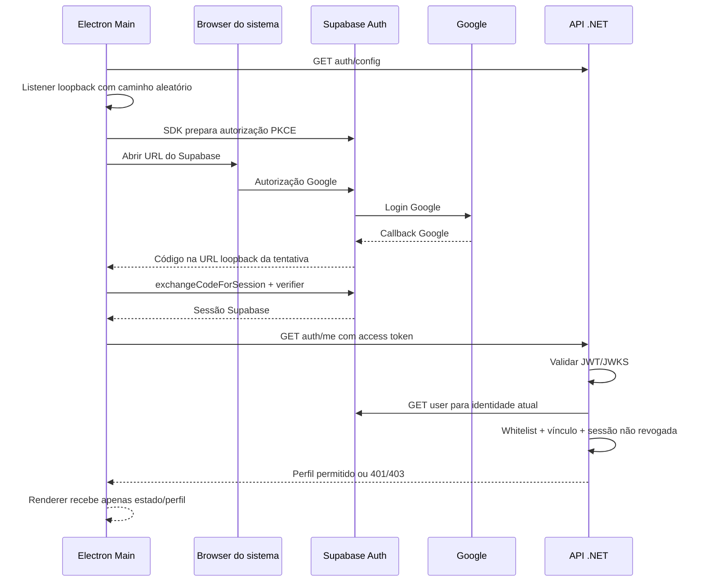

# Supabase Auth — configuração e operação

## Estado desta entrega

Implementação local do fluxo de autenticação, autorização por whitelist e logout. A publishable key foi salva em user-secrets e validada no endpoint de configurações do Supabase, que confirmou Google habilitado. A API local respondeu `enabled: true` com a configuração pública correta. O usuário confirmou o cadastro do redirect loopback. O email inicial autorizado foi cadastrado nos bancos local e remoto. As duas migrations foram aplicadas no Supabase pelo Session pooler e a API local retornou Healthy conectada ao banco remoto. O usuário confirmou o login Google real, com perfil e autorização exibidos no desktop, em 28/09/2026. A secret key fornecida não foi persistida nem é necessária para este fluxo.

Projeto informado: `https://YOUR_PROJECT_REF.supabase.co`.

O endpoint público JWKS respondeu com ES256 e a descoberta OIDC informou issuer `https://YOUR_PROJECT_REF.supabase.co/auth/v1`. A conexão PostgreSQL direta resolveu somente IPv6 e a tentativa TCP expirou nesta máquina. A credencial fornecida foi guardada em user-secrets com chave `ConnectionStrings:Supabase`; ela não está no repositório nem foi copiada ao desktop. A configuração ativa `ConnectionStrings:Database` agora usa a role remota `discorda_runtime`, com senha aleatória e privilégios limitados ao schema `discorda`. A conexão anterior foi preservada em `ConnectionStrings:Local`. A conexão administrativa fica em `ConnectionStrings:Supabase` para migrations; não usar a role de runtime para migrations.

## Configurar o Supabase

1. Em Authentication → Sign In / Providers, habilitar Google. O client ID/secret do Google ficam no painel do Supabase; configurar no Google Cloud o callback HTTPS indicado pelo próprio Supabase.
2. Em Authentication → URL Configuration → Redirect URLs, adicionar **`http://127.0.0.1:3000/redirect/*`**. O asterisco permite apenas o segmento aleatório de uma tentativa. Não configurar apenas `/redirect` e não usar um wildcard global.
3. Copiar a **publishable key** (prefixo `sb_publishable_`) ou a chave legada `anon`. Não usar `service_role`, `sb_secret_` ou senha do banco no campo da chave pública.
4. Manter assinatura JWT assimétrica (ES256 já foi observada). A API aceita ES256/RS256; não recebe o JWT secret simétrico.
5. Definir expiração do JWT conforme a política desejada do projeto. O código respeita `exp`, não pressupõe cinco minutos. Não confundir duração do JWT com validade da sessão/refresh token.

O cadastro em Authentication → OAuth Server com client ID, redirect e public client é outro fluxo. Ele exige uma página própria em Site URL + Authorization Path. Para o login Google direto implementado aqui, não é necessário utilizar ou alterar esse cadastro.

Referências: [Google](https://supabase.com/docs/guides/auth/social-login/auth-google), [redirects](https://supabase.com/docs/guides/auth/redirect-urls), [OAuth Server](https://supabase.com/docs/guides/auth/oauth-server/getting-started).

## Configuração local

No projeto da API, sem versionar credenciais:

```powershell
dotnet user-secrets set 'Supabase:Url' 'https://YOUR_PROJECT_REF.supabase.co' --project services/backend/Discorda.Api
dotnet user-secrets set 'Supabase:PublishableKey' 'SUA_CHAVE_PUBLICA' --project services/backend/Discorda.Api
```

A URL e a publishable key já foram salvas nesta máquina. O endpoint público `/api/v1/auth/config` entrega somente URL/chave pública válidas, ou `enabled: false` se estiver incompleto. A chave pública pode circular no cliente; ela não autoriza acesso às tabelas privadas.

Para IPv4, copiar **host e usuário exatos** de Connect → Session pooler, porta 5432. O pooler compartilhado oferece IPv4 no plano Free; o adicional pago de IPv4 é para a conexão direta. Não contratar adicionais: o projeto deve usar os recursos gratuitos. [Conexões Supabase](https://supabase.com/docs/guides/database/connecting-to-postgres).

Não deduzir o nome do pooler a partir do project-ref. Após testar a conexão, usar uma role de runtime com privilégios mínimos e conexão TLS `SSL Mode=VerifyFull`. A credencial `postgres` fornecida é administrativa; não será distribuída com o app. As duas migrations remotas foram executadas e a whitelist inicial aplicada. As roles `anon` e `authenticated` não têm USAGE no schema `discorda`. A role de runtime tem DML nas tabelas da aplicação e somente SELECT no histórico de migrations para a sonda de readiness.

## Whitelist

Executar localmente no servidor ou ambiente administrativo com conexão correta:

```powershell
dotnet run --project services/backend/Discorda.Api -- whitelist allow amigo@example.com
dotnet run --project services/backend/Discorda.Api -- whitelist block amigo@example.com
```

Não existe endpoint público de administração. A primeira entrada confirma email/provider Google pelo Supabase, vincula o UUID Auth à whitelist e cria uma ApplicationSession com o session_id assinado do token. Email sozinho não identifica o usuário permanentemente. Não transformar contas já existentes de outro emissor nem refazer vínculos automaticamente.

Bloquear uma conta desabilita a whitelist, revoga sessões locais existentes e grava auditoria. Reabilitar não restaura sessões revogadas: é necessário novo login. No futuro SignalR/mídia deverão consumir essa mesma política e encerrar suas conexões; ainda não existem nesta fase.

## Fluxo implementado



O SDK trata PKCE e refresh; não há protocolo OAuth próprio. Listener aceita somente GET, Host esperado, caminho aleatório da tentativa e um único código; rejeita requests com Origin e fecha após callback/cancelamento/timeout de cinco minutos. Não abrir listener em todas as interfaces nem transmitir tokens no callback.

O Main persiste a sessão Supabase criptografada por safeStorage. Credenciais do provider Google são descartadas da persistência. Sem cofre seguro, a sessão fica apenas na memória. Renderer não recebe refresh/access tokens nesta fase. A interface revalida o acesso a cada 30 segundos; a API verifica imediatamente em cada requisição.

Logout solicita primeiro revogação local ao .NET, depois signOut de escopo local no Supabase e remoção das credenciais do dispositivo. Quando a rede falha, o aplicativo informa que a revogação remota não foi confirmada; um token copiado pode continuar válido até expirar. Não prometer revogação instantânea somente pela exclusão do arquivo local.

## API

| Rota | Acesso | Comportamento |
|---|---|---|
| GET /api/v1/auth/config | Público | Apenas configuração pública válida |
| GET /api/v1/auth/me | JWT + whitelist | Perfil do membro e admissão idempotente |
| POST /api/v1/auth/logout | JWT + whitelist | Marca session_id como revogado |
| /health/live, /health/ready | Público | Sondas operacionais mínimas |

A política padrão exige membro autorizado para qualquer nova rota, salvo `AllowAnonymous` explícito. Tokens com issuer/audience/assinatura/expiração inválidos retornam 401; identidade válida sem whitelist ou com sessão local revogada retorna 403. `user_metadata.email_verified` e roles declaradas pelo cliente não são aceitos como prova.

## Testes e limites

Testes locais cobrem JWT inválido, expiração, issuer/audience, email não confirmado, identidade sem Google, whitelist, primeiro login concorrente, bloqueio/reabilitação, logout, callback inválido/cancelado e cofre sem armazenamento seguro. O Supabase Auth é simulado somente nos testes do backend; PostgreSQL é real em containers. Não há bypass de autenticação no produto.

O login Google real foi confirmado pelo usuário no desktop; a configuração da API, o banco remoto e a whitelist foram validados. Nenhuma conta real foi autenticada automaticamente, a whitelist contém somente o email explicitamente autorizado e as migrations criaram o schema `discorda` no banco remoto.


